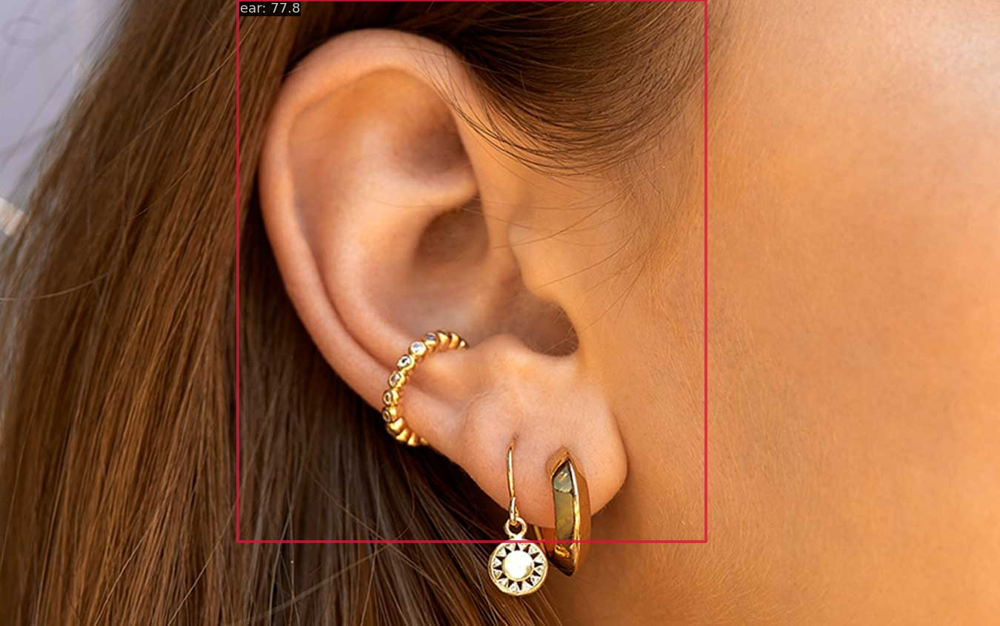
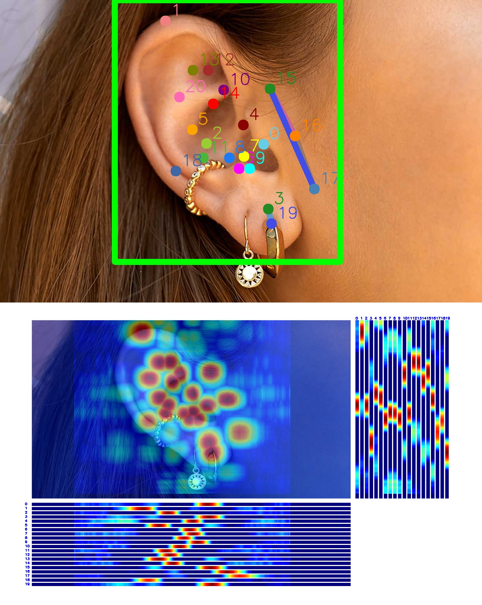

# 第一次作业

## 使用MMDetection算法库，训练RTMDet耳朵目标检测算法，测试结果

```python
DONE (t=0.13s).
Accumulating evaluation results...
DONE (t=0.01s).
 Average Precision  (AP) @[ IoU=0.50:0.95 | area=   all | maxDets=100 ] = 0.806
 Average Precision  (AP) @[ IoU=0.50      | area=   all | maxDets=100 ] = 0.967
 Average Precision  (AP) @[ IoU=0.75      | area=   all | maxDets=100 ] = 0.967
 Average Precision  (AP) @[ IoU=0.50:0.95 | area= small | maxDets=100 ] = -1.000
 Average Precision  (AP) @[ IoU=0.50:0.95 | area=medium | maxDets=100 ] = -1.000
 Average Precision  (AP) @[ IoU=0.50:0.95 | area= large | maxDets=100 ] = 0.806
 Average Recall     (AR) @[ IoU=0.50:0.95 | area=   all | maxDets=  1 ] = 0.829
 Average Recall     (AR) @[ IoU=0.50:0.95 | area=   all | maxDets= 10 ] = 0.829
 Average Recall     (AR) @[ IoU=0.50:0.95 | area=   all | maxDets=100 ] = 0.829
 Average Recall     (AR) @[ IoU=0.50:0.95 | area= small | maxDets=100 ] = -1.000
 Average Recall     (AR) @[ IoU=0.50:0.95 | area=medium | maxDets=100 ] = -1.000
 Average Recall     (AR) @[ IoU=0.50:0.95 | area= large | maxDets=100 ] = 0.829
06/04 15:52:31 - mmengine - INFO - bbox_mAP_copypaste: 0.806 0.967 0.967 -1.000 -1.000 0.806
06/04 15:52:31 - mmengine - INFO - Epoch(val) [200][21/21]    coco/bbox_mAP: 0.8060  coco/bbox_mAP_50: 0.9670  coco/bbox_mAP_75: 0.9670  coco/bbox_mAP_s: -1.0000  coco/bbox_mAP_m: -1.0000  coco/bbox_mAP_l: 0.8060  data_time: 0.1712  time: 0.1917
```




## 使用MMPose算法库，训练RTMPose耳朵关键点检测算法，测试结果

```python
2023/06/04 20:05:36 - mmengine - INFO - Exp name: rtmpose-s-ear_20230604_171242
2023/06/04 20:05:36 - mmengine - INFO - Epoch(train) [300][6/6]  lr: 2.000116e-04  eta: 0:00:00  time: 5.820198  data_time: 5.708602  memory: 572  loss: 0.028253  loss_kpt: 0.028253  acc_pose: 1.000000
2023/06/04 20:05:36 - mmengine - INFO - Saving checkpoint at 300 epochs
2023/06/04 20:05:42 - mmengine - INFO - Epoch(val) [300][1/6]    eta: 0:00:06  time: 1.068795  data_time: 1.052521  memory: 278  
2023/06/04 20:05:44 - mmengine - INFO - Epoch(val) [300][2/6]    eta: 0:00:05  time: 1.087325  data_time: 1.070981  memory: 278  
2023/06/04 20:05:45 - mmengine - INFO - Epoch(val) [300][3/6]    eta: 0:00:03  time: 1.085384  data_time: 1.069042  memory: 278  
2023/06/04 20:05:46 - mmengine - INFO - Epoch(val) [300][4/6]    eta: 0:00:02  time: 1.084895  data_time: 1.068562  memory: 278  
2023/06/04 20:05:47 - mmengine - INFO - Epoch(val) [300][5/6]    eta: 0:00:01  time: 1.085529  data_time: 1.069290  memory: 278  
2023/06/04 20:05:48 - mmengine - INFO - Epoch(val) [300][6/6]    eta: 0:00:00  time: 1.068064  data_time: 1.051982  memory: 254  
2023/06/04 20:05:48 - mmengine - INFO - Evaluating CocoMetric...
2023/06/04 20:05:48 - mmengine - INFO - Evaluating PCKAccuracy (normalized by ``"bbox_size"``)...
2023/06/04 20:05:48 - mmengine - INFO - Evaluating AUC...
2023/06/04 20:05:48 - mmengine - INFO - Evaluating NME...
2023/06/04 20:05:48 - mmengine - INFO - Epoch(val) [300][6/6]    coco/AP: 0.723926  coco/AP .5: 1.000000  coco/AP .75: 0.948805  coco/AP (M): -1.000000  coco/AP (L): 0.723926  coco/AR: 0.776190  coco/AR .5: 1.000000  coco/AR .75: 0.952381  coco/AR (M): -1.000000  coco/AR (L): 0.776190  PCK: 0.967120  AUC: 0.146088  NME: 0.039541  data_time: 0.955821  time: 0.971285

```




